# GeminiGatewayClient アーキテクチャ

実装の構成と処理の流れを図で示します。図に出てくる名前はすべて `GeminiGatewayClient/` のソースと一致します。

## 1. ユースケース

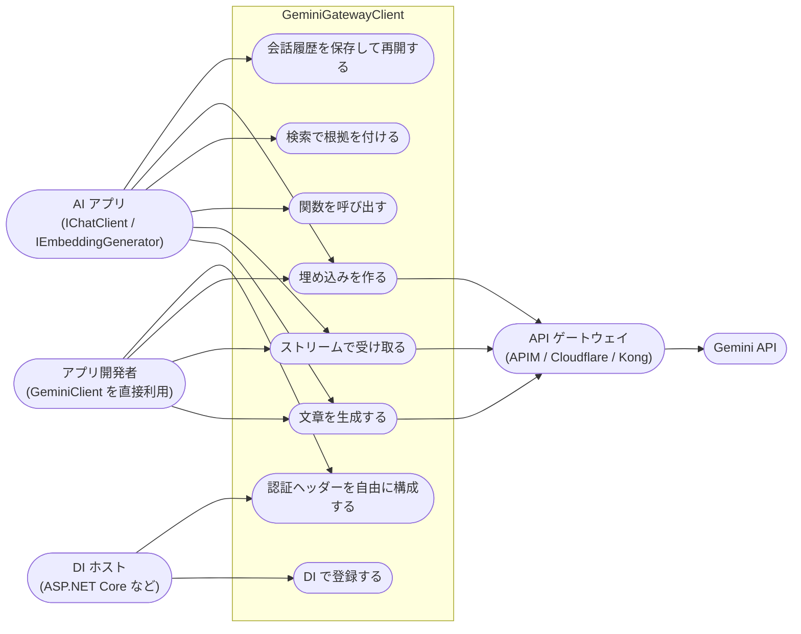
```mermaid
flowchart LR
    Dev(["アプリ開発者<br/>(GeminiClient を直接利用)"])
    Meai(["AI アプリ<br/>(IChatClient / IEmbeddingGenerator)"])
    Host(["DI ホスト<br/>(ASP.NET Core など)"])
    Gateway(["API ゲートウェイ<br/>(APIM / Cloudflare / Kong)"])
    Gemini(["Gemini API"])

    subgraph Lib["GeminiGatewayClient"]
        UC1(["文章を生成する"])
        UC2(["ストリームで受け取る"])
        UC3(["関数を呼び出す"])
        UC4(["検索で根拠を付ける"])
        UC5(["埋め込みを作る"])
        UC6(["会話履歴を保存して再開する"])
        UC7(["認証ヘッダーを自由に構成する"])
        UC8(["DI で登録する"])
    end

    Dev --> UC1
    Dev --> UC2
    Dev --> UC5
    Dev --> UC7
    Meai --> UC1
    Meai --> UC2
    Meai --> UC3
    Meai --> UC4
    Meai --> UC5
    Meai --> UC6
    Host --> UC8
    Host --> UC7
    UC1 --> Gateway
    UC2 --> Gateway
    UC5 --> Gateway
    Gateway --> Gemini
```

一番の特徴は「認証ヘッダーを自由に構成する」です。ヘッダー名、接頭辞、呼び出しごとのキー、キーなしのすべてに対応します。

## 2. 層と依存の向き

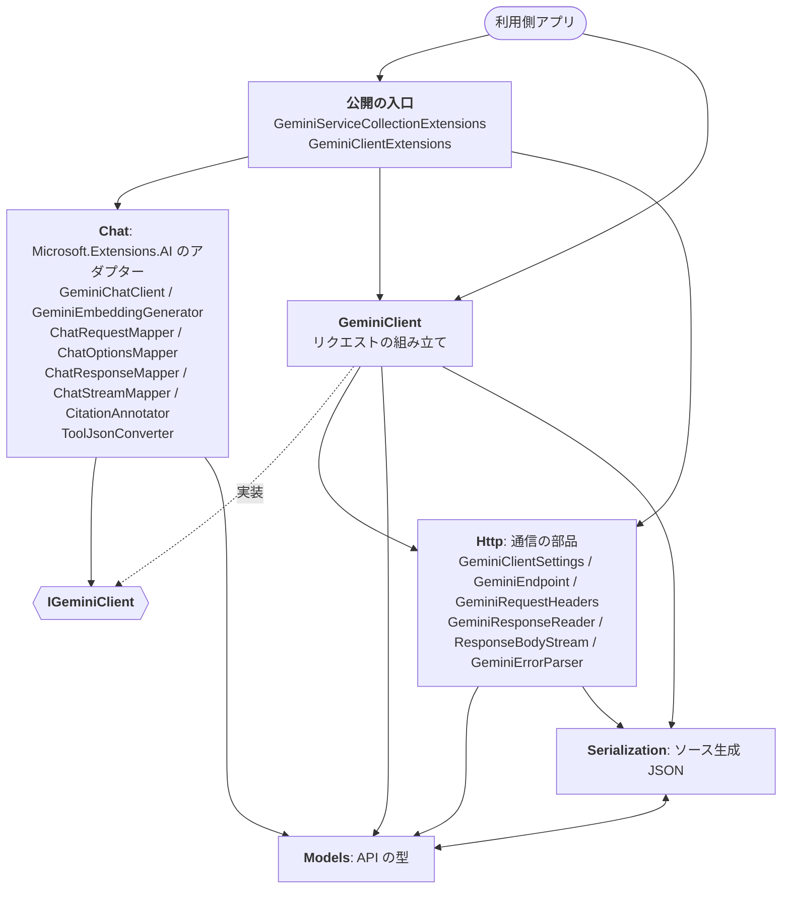
```mermaid
flowchart TB
    App(["利用側アプリ"])
    Entry["<b>公開の入口</b><br/>GeminiServiceCollectionExtensions<br/>GeminiClientExtensions"]
    Chat["<b>Chat</b>: Microsoft.Extensions.AI のアダプター<br/>GeminiChatClient / GeminiEmbeddingGenerator<br/>ChatRequestMapper / ChatOptionsMapper<br/>ChatResponseMapper / ChatStreamMapper / CitationAnnotator<br/>ToolJsonConverter"]
    Contract{{"<b>IGeminiClient</b>"}}
    Core["<b>GeminiClient</b><br/>リクエストの組み立て"]
    Http["<b>Http</b>: 通信の部品<br/>GeminiClientSettings / GeminiEndpoint / GeminiRequestHeaders<br/>GeminiResponseReader / ResponseBodyStream / GeminiErrorParser"]
    Models["<b>Models</b>: API の型"]
    Serial["<b>Serialization</b>: ソース生成 JSON"]

    App --> Entry
    App --> Core
    Entry --> Chat
    Entry --> Core
    Entry --> Http
    Chat --> Contract
    Core -. 実装 .-> Contract
    Core --> Http
    Core --> Models
    Core --> Serial
    Chat --> Models
    Http --> Models
    Http --> Serial
    Serial <--> Models
```

- Chat 層は通信を `IGeminiClient` だけに頼ります。HTTP の詳細を知りません。
- `Models` と `Serialization` の相互参照だけが循環です。モデルが寛容な enum コンバーターを使い、JSON コンテキストがモデルを列挙するためです。

## 3. クラス図

### 3.1 クライアント本体と通信

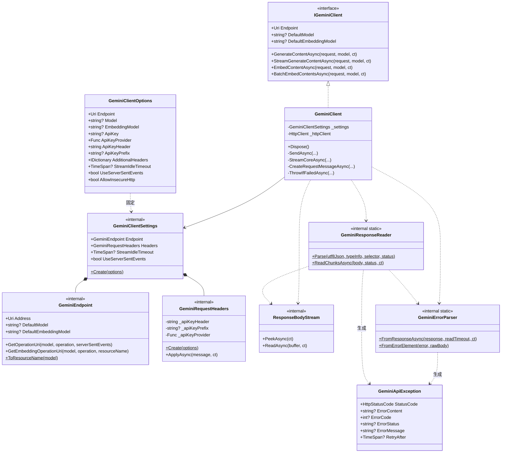
```mermaid
classDiagram
    direction TB

    class IGeminiClient {
        <<interface>>
        +Uri Endpoint
        +string? DefaultModel
        +string? DefaultEmbeddingModel
        +GenerateContentAsync(request, model, ct)
        +StreamGenerateContentAsync(request, model, ct)
        +EmbedContentAsync(request, model, ct)
        +BatchEmbedContentsAsync(request, model, ct)
    }

    class GeminiClient {
        -GeminiClientSettings _settings
        -HttpClient _httpClient
        +Dispose()
        -SendAsync(...)
        -StreamCoreAsync(...)
        -CreateRequestMessageAsync(...)
        -ThrowIfFailedAsync(...)
    }

    class GeminiClientOptions {
        +Uri Endpoint
        +string? Model
        +string? EmbeddingModel
        +string? ApiKey
        +Func ApiKeyProvider
        +string ApiKeyHeader
        +string? ApiKeyPrefix
        +IDictionary AdditionalHeaders
        +TimeSpan? StreamIdleTimeout
        +bool UseServerSentEvents
        +bool AllowInsecureHttp
    }

    class GeminiClientSettings {
        <<internal>>
        +GeminiEndpoint Endpoint
        +GeminiRequestHeaders Headers
        +TimeSpan? StreamIdleTimeout
        +bool UseServerSentEvents
        +Create(options)$
    }

    class GeminiEndpoint {
        <<internal>>
        +Uri Address
        +string? DefaultModel
        +string? DefaultEmbeddingModel
        +GetOperationUri(model, operation, serverSentEvents)
        +GetEmbeddingOperationUri(model, operation, resourceName)
        +ToResourceName(model)$
    }

    class GeminiRequestHeaders {
        <<internal>>
        -string _apiKeyHeader
        -string? _apiKeyPrefix
        -Func _apiKeyProvider
        +Create(options)$
        +ApplyAsync(message, ct)
    }

    class GeminiResponseReader {
        <<internal static>>
        +Parse(utf8Json, typeInfo, selector, status)$
        +ReadChunksAsync(body, status, ct)$
    }

    class ResponseBodyStream {
        <<internal>>
        +PeekAsync(ct)
        +ReadAsync(buffer, ct)
    }

    class GeminiErrorParser {
        <<internal static>>
        +FromResponseAsync(response, readTimeout, ct)$
        +FromErrorElement(error, rawBody)$
    }

    class GeminiApiException {
        +HttpStatusCode StatusCode
        +string? ErrorContent
        +int? ErrorCode
        +string? ErrorStatus
        +string? ErrorMessage
        +TimeSpan? RetryAfter
    }

    IGeminiClient <|.. GeminiClient
    GeminiClient --> GeminiClientSettings
    GeminiClientOptions ..> GeminiClientSettings : 固定
    GeminiClientSettings *-- GeminiEndpoint
    GeminiClientSettings *-- GeminiRequestHeaders
    GeminiClient ..> GeminiResponseReader
    GeminiClient ..> ResponseBodyStream
    GeminiClient ..> GeminiErrorParser
    GeminiResponseReader ..> ResponseBodyStream
    GeminiResponseReader ..> GeminiErrorParser
    GeminiErrorParser ..> GeminiApiException : 生成
    GeminiResponseReader ..> GeminiApiException : 生成
```

`GeminiClientSettings` は不変スナップショットです。`GeminiClientOptions` を後から変更しても、作成済みのクライアントには影響しません。

### 3.2 Microsoft.Extensions.AI アダプター

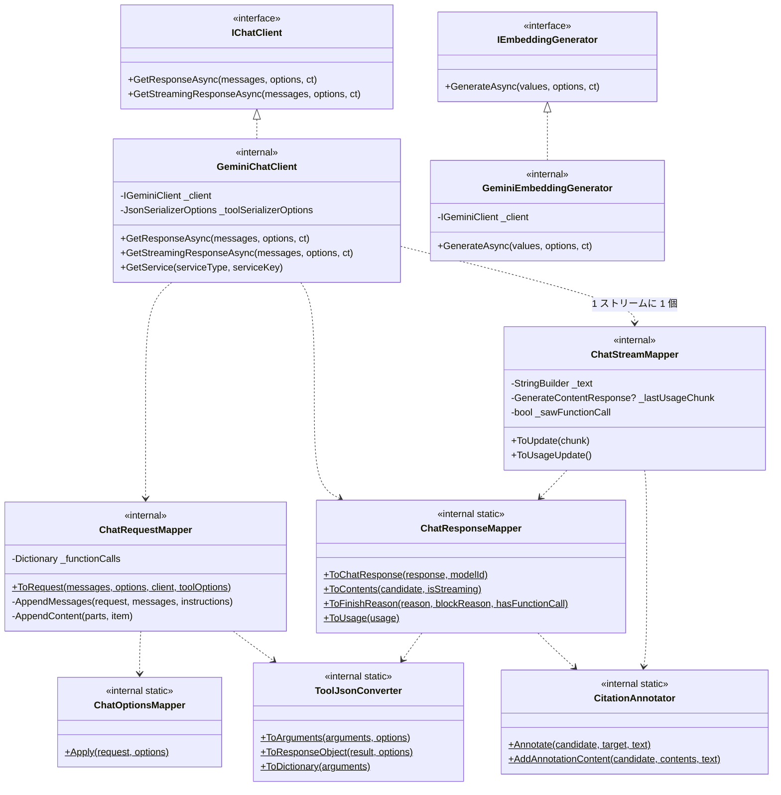
```mermaid
classDiagram
    direction TB

    class IChatClient {
        <<interface>>
        +GetResponseAsync(messages, options, ct)
        +GetStreamingResponseAsync(messages, options, ct)
    }

    class IEmbeddingGenerator {
        <<interface>>
        +GenerateAsync(values, options, ct)
    }

    class GeminiChatClient {
        <<internal>>
        -IGeminiClient _client
        -JsonSerializerOptions _toolSerializerOptions
        +GetResponseAsync(messages, options, ct)
        +GetStreamingResponseAsync(messages, options, ct)
        +GetService(serviceType, serviceKey)
    }

    class GeminiEmbeddingGenerator {
        <<internal>>
        -IGeminiClient _client
        +GenerateAsync(values, options, ct)
    }

    class ChatRequestMapper {
        <<internal>>
        -Dictionary _functionCalls
        +ToRequest(messages, options, client, toolOptions)$
        -AppendMessages(request, messages, instructions)
        -AppendContent(parts, item)
    }

    class ChatOptionsMapper {
        <<internal static>>
        +Apply(request, options)$
    }

    class ChatResponseMapper {
        <<internal static>>
        +ToChatResponse(response, modelId)$
        +ToContents(candidate, isStreaming)$
        +ToFinishReason(reason, blockReason, hasFunctionCall)$
        +ToUsage(usage)$
    }

    class ChatStreamMapper {
        <<internal>>
        -StringBuilder _text
        -GenerateContentResponse? _lastUsageChunk
        -bool _sawFunctionCall
        +ToUpdate(chunk)
        +ToUsageUpdate()
    }

    class CitationAnnotator {
        <<internal static>>
        +Annotate(candidate, target, text)$
        +AddAnnotationContent(candidate, contents, text)$
    }

    class ToolJsonConverter {
        <<internal static>>
        +ToArguments(arguments, options)$
        +ToResponseObject(result, options)$
        +ToDictionary(arguments)$
    }

    IChatClient <|.. GeminiChatClient
    IEmbeddingGenerator <|.. GeminiEmbeddingGenerator
    GeminiChatClient ..> ChatRequestMapper
    GeminiChatClient ..> ChatResponseMapper
    GeminiChatClient ..> ChatStreamMapper : 1 ストリームに 1 個
    ChatRequestMapper ..> ChatOptionsMapper
    ChatRequestMapper ..> ToolJsonConverter
    ChatResponseMapper ..> ToolJsonConverter
    ChatResponseMapper ..> CitationAnnotator
    ChatStreamMapper ..> ChatResponseMapper
    ChatStreamMapper ..> CitationAnnotator
```

状態を持つ処理は、インスタンスが状態を抱えます。`ChatRequestMapper` は 1 リクエスト、`ChatStreamMapper` は 1 ストリームの間だけ生きます。

### 3.3 主要なモデル

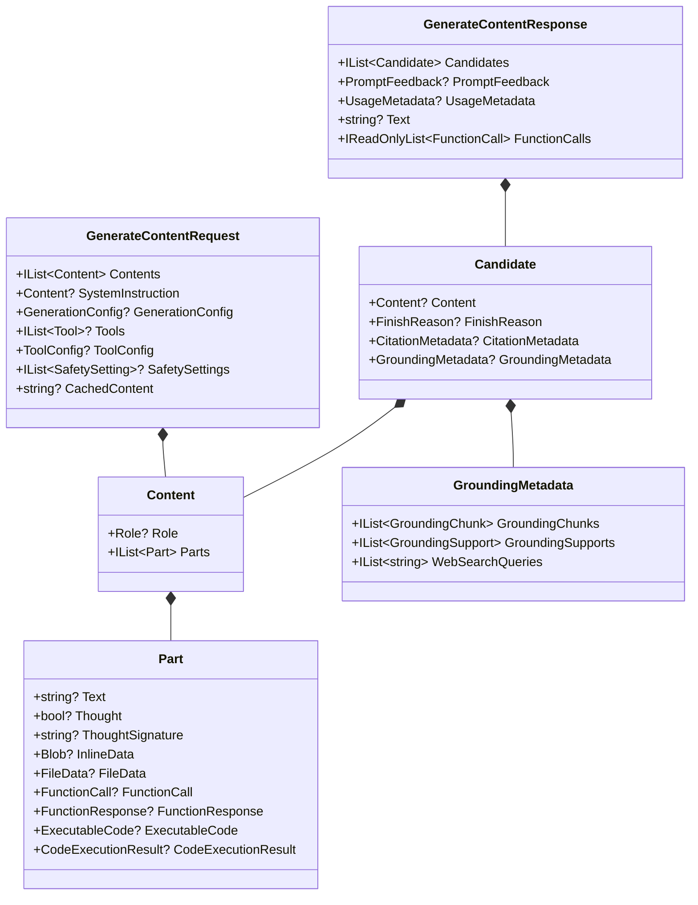
```mermaid
classDiagram
    direction TB

    class GenerateContentRequest {
        +IList~Content~ Contents
        +Content? SystemInstruction
        +GenerationConfig? GenerationConfig
        +IList~Tool~? Tools
        +ToolConfig? ToolConfig
        +IList~SafetySetting~? SafetySettings
        +string? CachedContent
    }

    class GenerateContentResponse {
        +IList~Candidate~ Candidates
        +PromptFeedback? PromptFeedback
        +UsageMetadata? UsageMetadata
        +string? Text
        +IReadOnlyList~FunctionCall~ FunctionCalls
    }

    class Candidate {
        +Content? Content
        +FinishReason? FinishReason
        +CitationMetadata? CitationMetadata
        +GroundingMetadata? GroundingMetadata
    }

    class Content {
        +Role? Role
        +IList~Part~ Parts
    }

    class Part {
        +string? Text
        +bool? Thought
        +string? ThoughtSignature
        +Blob? InlineData
        +FileData? FileData
        +FunctionCall? FunctionCall
        +FunctionResponse? FunctionResponse
        +ExecutableCode? ExecutableCode
        +CodeExecutionResult? CodeExecutionResult
    }

    class GroundingMetadata {
        +IList~GroundingChunk~ GroundingChunks
        +IList~GroundingSupport~ GroundingSupports
        +IList~string~ WebSearchQueries
    }

    GenerateContentRequest *-- Content
    GenerateContentResponse *-- Candidate
    Candidate *-- Content
    Candidate *-- GroundingMetadata
    Content *-- Part
```

ほぼすべてのモデルが `ExtensionData` を持ち、このライブラリが知らないフィールドも保持します。`IChatClient` 経由では `RawRepresentation` が残っている間だけ送り返せるので、履歴を JSON に保存すると失われます。

## 4. シーケンス図

### 4.1 生成(ストリームなし)

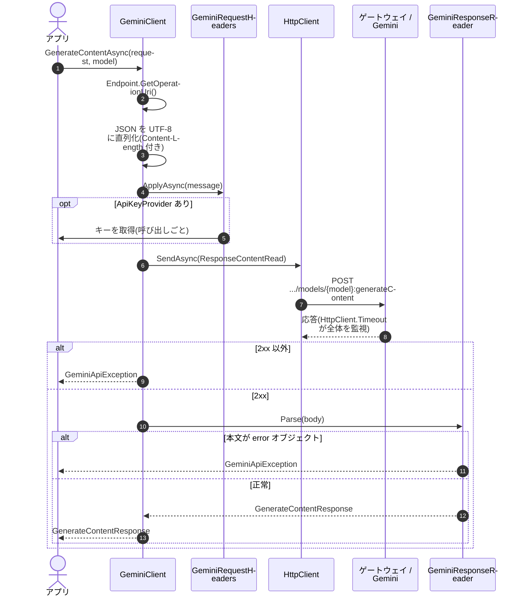
```mermaid
%%{init: {'sequence': {'wrap': true, 'actorMargin': 24, 'width': 130, 'messageMargin': 30}}}%%
sequenceDiagram
    autonumber
    actor App as アプリ
    participant Client as GeminiClient
    participant Headers as GeminiRequestHeaders
    participant Http as HttpClient
    participant GW as ゲートウェイ / Gemini
    participant Reader as GeminiResponseReader

    App->>Client: GenerateContentAsync(request, model)
    Client->>Client: Endpoint.GetOperationUri()
    Client->>Client: JSON を UTF-8 に直列化(Content-Length 付き)
    Client->>Headers: ApplyAsync(message)
    opt ApiKeyProvider あり
        Headers->>App: キーを取得(呼び出しごと)
    end
    Client->>Http: SendAsync(ResponseContentRead)
    Http->>GW: POST .../models/{model}:generateContent
    GW-->>Http: 応答(HttpClient.Timeout が全体を監視)
    alt 2xx 以外
        Client-->>App: GeminiApiException
    else 2xx
        Client->>Reader: Parse(body)
        alt 本文が error オブジェクト
            Reader-->>App: GeminiApiException
        else 正常
            Reader-->>Client: GenerateContentResponse
            Client-->>App: GenerateContentResponse
        end
    end
```

### 4.2 ストリーム

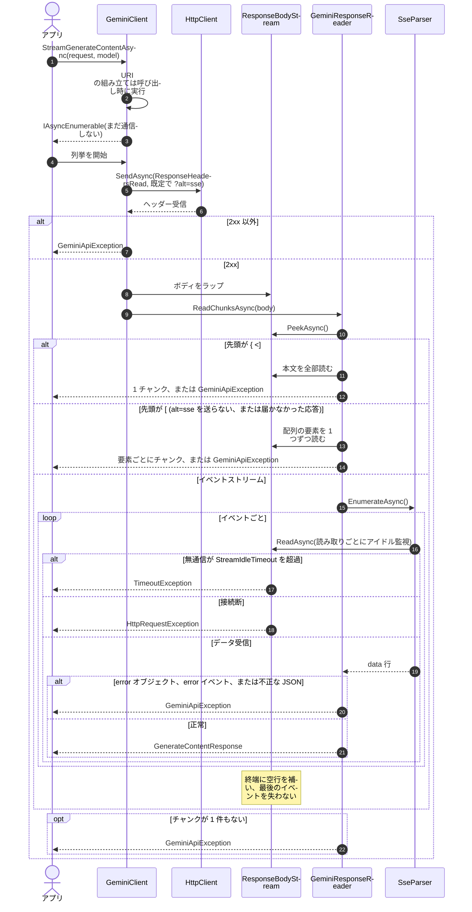
```mermaid
%%{init: {'sequence': {'wrap': true, 'actorMargin': 24, 'width': 130, 'messageMargin': 30}}}%%
sequenceDiagram
    autonumber
    actor App as アプリ
    participant Client as GeminiClient
    participant Http as HttpClient
    participant Body as ResponseBodyStream
    participant Reader as GeminiResponseReader
    participant Sse as SseParser

    App->>Client: StreamGenerateContentAsync(request, model)
    Client->>Client: URI の組み立ては呼び出し時に実行
    Client-->>App: IAsyncEnumerable(まだ通信しない)
    App->>Client: 列挙を開始
    Client->>Http: SendAsync(ResponseHeadersRead, 既定で ?alt=sse)
    Http-->>Client: ヘッダー受信
    alt 2xx 以外
        Client-->>App: GeminiApiException
    else 2xx
        Client->>Body: ボディをラップ
        Client->>Reader: ReadChunksAsync(body)
        Reader->>Body: PeekAsync()
        alt 先頭が { <
            Reader->>Body: 本文を全部読む
            Reader-->>App: 1 チャンク、または GeminiApiException
        else 先頭が [ (alt=sse を送らない、または届かなかった応答)
            Reader->>Body: 配列の要素を 1 つずつ読む
            Reader-->>App: 要素ごとにチャンク、または GeminiApiException
        else イベントストリーム
            Reader->>Sse: EnumerateAsync()
            loop イベントごと
                Sse->>Body: ReadAsync(読み取りごとにアイドル監視)
                alt 無通信が StreamIdleTimeout を超過
                    Body-->>App: TimeoutException
                else 接続断
                    Body-->>App: HttpRequestException
                else データ受信
                    Sse-->>Reader: data 行
                    alt error オブジェクト、error イベント、または不正な JSON
                        Reader-->>App: GeminiApiException
                    else 正常
                        Reader-->>App: GenerateContentResponse
                    end
                end
            end
            Note over Body: 終端に空行を補い、最後のイベントを失わない
        end
        opt チャンクが 1 件もない
            Reader-->>App: GeminiApiException
        end
    end
```

アイドルタイマーは読み取りの間だけ動きます。利用側の処理が遅くても、サーバーの無通信とは扱いません。ゲートウェイのキープアライブのコメントも受信データなので、タイマーを止めます。

### 4.3 IChatClient(ストリームなし)

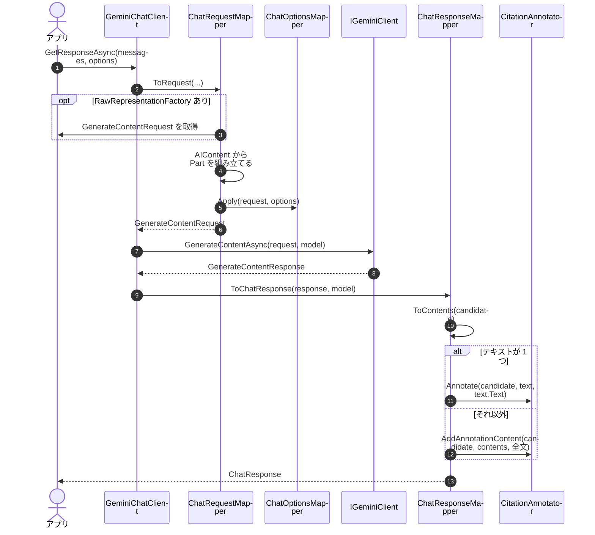
```mermaid
%%{init: {'sequence': {'wrap': true, 'actorMargin': 24, 'width': 130, 'messageMargin': 30}}}%%
sequenceDiagram
    autonumber
    actor App as アプリ
    participant Chat as GeminiChatClient
    participant Req as ChatRequestMapper
    participant Options as ChatOptionsMapper
    participant Client as IGeminiClient
    participant Res as ChatResponseMapper
    participant Cite as CitationAnnotator

    App->>Chat: GetResponseAsync(messages, options)
    Chat->>Req: ToRequest(...)
    opt RawRepresentationFactory あり
        Req->>App: GenerateContentRequest を取得
    end
    Req->>Req: AIContent から Part を組み立てる
    Req->>Options: Apply(request, options)
    Req-->>Chat: GenerateContentRequest
    Chat->>Client: GenerateContentAsync(request, model)
    Client-->>Chat: GenerateContentResponse
    Chat->>Res: ToChatResponse(response, model)
    Res->>Res: ToContents(candidate)
    alt テキストが 1 つ
        Res->>Cite: Annotate(candidate, text, text.Text)
    else それ以外
        Res->>Cite: AddAnnotationContent(candidate, contents, 全文)
    end
    Res-->>App: ChatResponse
```

### 4.4 IChatClient(ストリーム)

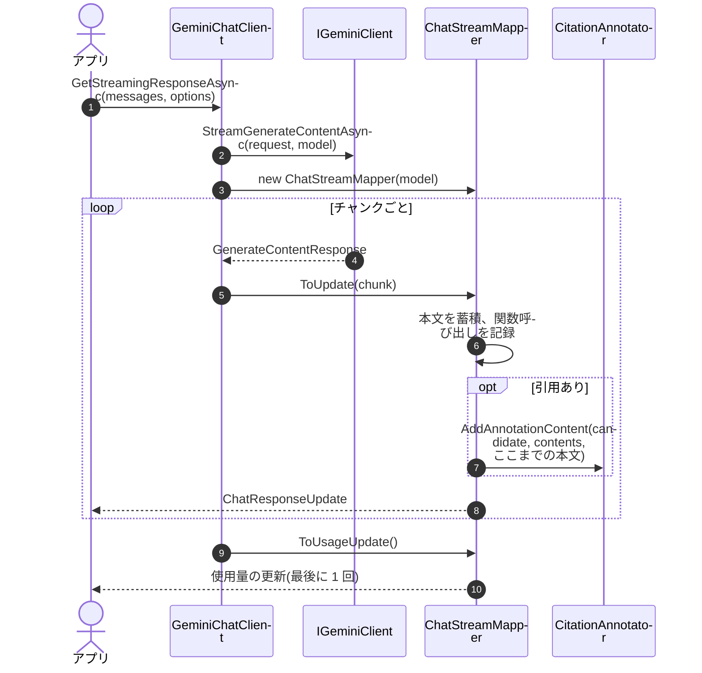
```mermaid
%%{init: {'sequence': {'wrap': true, 'actorMargin': 24, 'width': 130, 'messageMargin': 30}}}%%
sequenceDiagram
    autonumber
    actor App as アプリ
    participant Chat as GeminiChatClient
    participant Client as IGeminiClient
    participant Map as ChatStreamMapper
    participant Cite as CitationAnnotator

    App->>Chat: GetStreamingResponseAsync(messages, options)
    Chat->>Client: StreamGenerateContentAsync(request, model)
    Chat->>Map: new ChatStreamMapper(model)
    loop チャンクごと
        Client-->>Chat: GenerateContentResponse
        Chat->>Map: ToUpdate(chunk)
        Map->>Map: 本文を蓄積、関数呼び出しを記録
        opt 引用あり
            Map->>Cite: AddAnnotationContent(candidate, contents, ここまでの本文)
        end
        Map-->>App: ChatResponseUpdate
    end
    Chat->>Map: ToUsageUpdate()
    Map-->>App: 使用量の更新(最後に 1 回)
```

配信済みの更新は書き換えません。引用は、それが届いたチャンクの更新に注釈専用の `AIContent` として載ります。位置は応答本文の先頭から数えます。

### 4.5 関数呼び出しと署名の往復

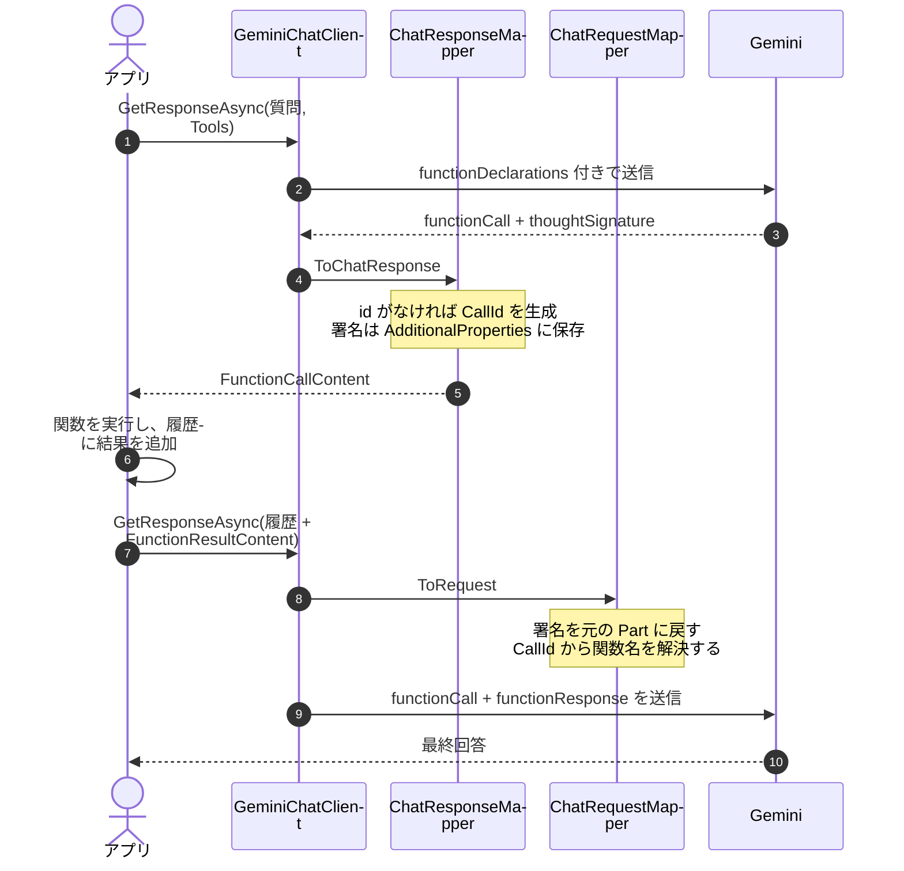
```mermaid
%%{init: {'sequence': {'wrap': true, 'actorMargin': 24, 'width': 130, 'messageMargin': 30}}}%%
sequenceDiagram
    autonumber
    actor App as アプリ
    participant Chat as GeminiChatClient
    participant Res as ChatResponseMapper
    participant Req as ChatRequestMapper
    participant API as Gemini

    App->>Chat: GetResponseAsync(質問, Tools)
    Chat->>API: functionDeclarations 付きで送信
    API-->>Chat: functionCall + thoughtSignature
    Chat->>Res: ToChatResponse
    Note over Res: id がなければ CallId を生成<br/>署名は AdditionalProperties に保存
    Res-->>App: FunctionCallContent
    App->>App: 関数を実行し、履歴に結果を追加
    App->>Chat: GetResponseAsync(履歴 + FunctionResultContent)
    Chat->>Req: ToRequest
    Note over Req: 署名を元の Part に戻す<br/>CallId から関数名を解決する
    Chat->>API: functionCall + functionResponse を送信
    API-->>App: 最終回答
```

関数呼び出しやテキストの署名は `AdditionalProperties`、思考の署名は `ProtectedData` にあるので、履歴を JSON に保存して読み戻しても残ります。チャットに対応づけられない未知のパートは `RawRepresentation` にしかないため、保存すると失われます。

### 4.6 埋め込み

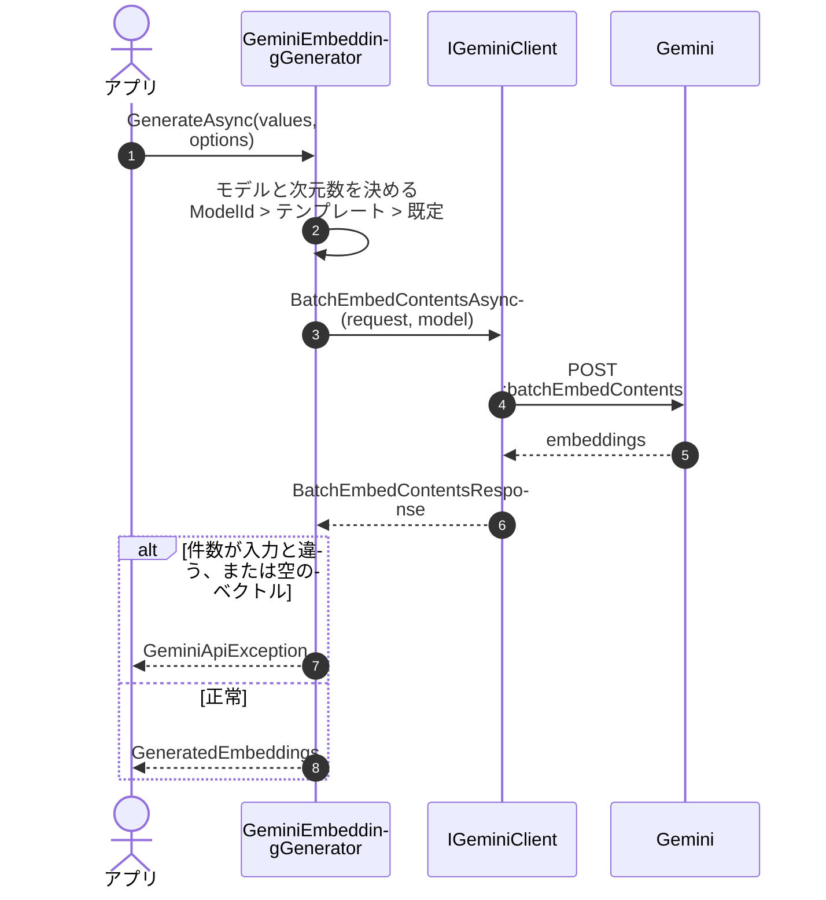
```mermaid
%%{init: {'sequence': {'wrap': true, 'actorMargin': 24, 'width': 130, 'messageMargin': 30}}}%%
sequenceDiagram
    autonumber
    actor App as アプリ
    participant Gen as GeminiEmbeddingGenerator
    participant Client as IGeminiClient
    participant API as Gemini

    App->>Gen: GenerateAsync(values, options)
    Gen->>Gen: モデルと次元数を決める<br/>ModelId > テンプレート > 既定
    Gen->>Client: BatchEmbedContentsAsync(request, model)
    Client->>API: POST :batchEmbedContents
    API-->>Client: embeddings
    Client-->>Gen: BatchEmbedContentsResponse
    alt 件数が入力と違う、または空のベクトル
        Gen-->>App: GeminiApiException
    else 正常
        Gen-->>App: GeneratedEmbeddings
    end
```

### 4.7 DI の登録と解決

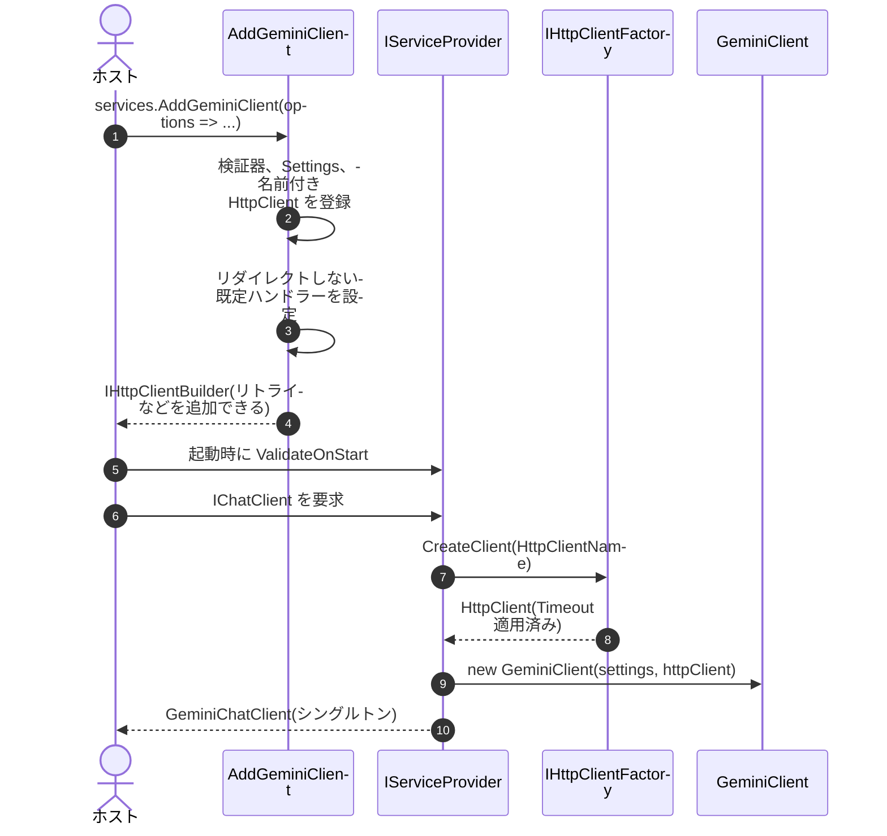
```mermaid
%%{init: {'sequence': {'wrap': true, 'actorMargin': 24, 'width': 130, 'messageMargin': 30}}}%%
sequenceDiagram
    autonumber
    actor Host as ホスト
    participant Ext as AddGeminiClient
    participant SP as IServiceProvider
    participant Factory as IHttpClientFactory
    participant Client as GeminiClient

    Host->>Ext: services.AddGeminiClient(options => ...)
    Ext->>Ext: 検証器、Settings、名前付き HttpClient を登録
    Ext->>Ext: リダイレクトしない既定ハンドラーを設定
    Ext-->>Host: IHttpClientBuilder(リトライなどを追加できる)
    Host->>SP: 起動時に ValidateOnStart
    Host->>SP: IChatClient を要求
    SP->>Factory: CreateClient(HttpClientName)
    Factory-->>SP: HttpClient(Timeout 適用済み)
    SP->>Client: new GeminiClient(settings, httpClient)
    SP-->>Host: GeminiChatClient(シングルトン)
```

## 5. 判定の流れ

### 5.1 認証ヘッダーの組み立て

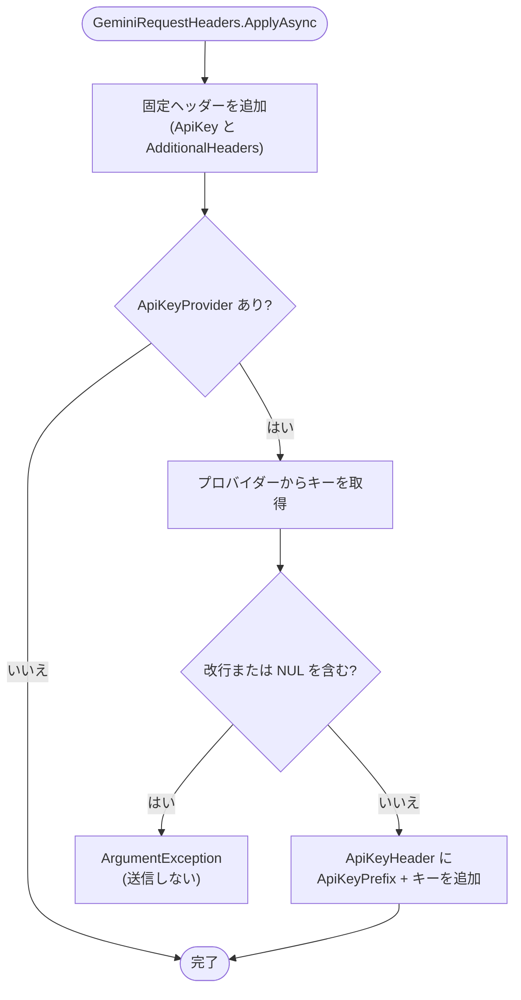
```mermaid
flowchart TD
    Start(["GeminiRequestHeaders.ApplyAsync"]) --> Static["固定ヘッダーを追加<br/>(ApiKey と AdditionalHeaders)"]
    Static --> HasProvider{"ApiKeyProvider あり?"}
    HasProvider -- いいえ --> Done(["完了"])
    HasProvider -- はい --> Call["プロバイダーからキーを取得"]
    Call --> Valid{"改行または NUL を含む?"}
    Valid -- はい --> Fail["ArgumentException<br/>(送信しない)"]
    Valid -- いいえ --> Add["ApiKeyHeader に<br/>ApiKeyPrefix + キーを追加"]
    Add --> Done
```

`ApiKey` と `ApiKeyProvider` はどちらも省略できます。その場合は認証ヘッダーを送りません。ゲートウェイがキーを注入する構成で使います。

### 5.2 呼び出しで発生する例外

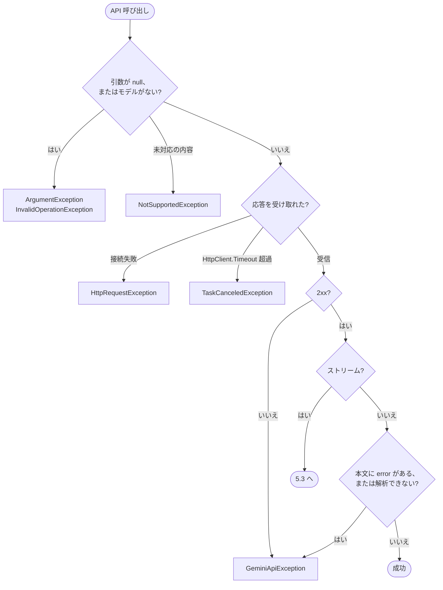
```mermaid
flowchart TD
    Call(["API 呼び出し"]) --> Arg{"引数が null、<br/>またはモデルがない?"}
    Arg -- はい --> E1["ArgumentException<br/>InvalidOperationException"]
    Arg -- 未対応の内容 --> E6["NotSupportedException"]
    Arg -- いいえ --> Net{"応答を受け取れた?"}
    Net -- 接続失敗 --> E2["HttpRequestException"]
    Net -- HttpClient.Timeout 超過 --> E3["TaskCanceledException"]
    Net -- 受信 --> Status{"2xx?"}
    Status -- いいえ --> E4["GeminiApiException"]
    Status -- はい --> Mode{"ストリーム?"}
    Mode -- はい --> Stream(["5.3 へ"])
    Mode -- いいえ --> Body{"本文に error がある、<br/>または解析できない?"}
    Body -- はい --> E4
    Body -- いいえ --> Ok(["成功"])
```

### 5.3 ストリームの読み取りで発生する例外

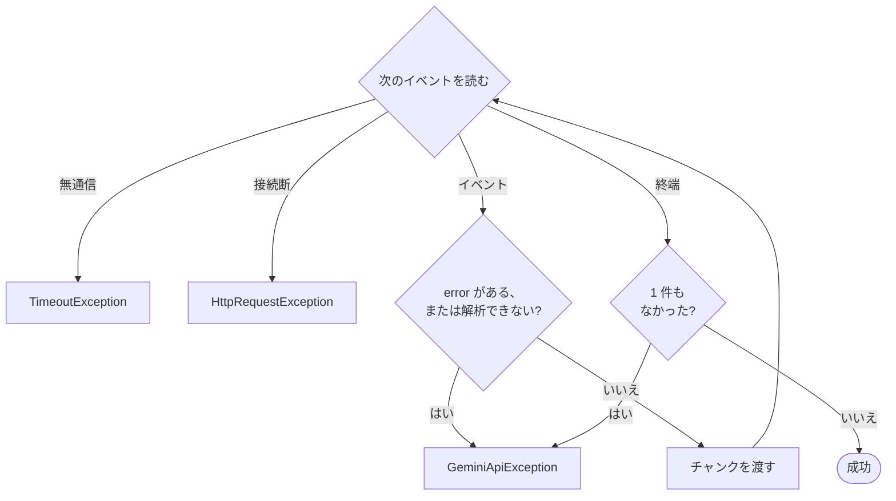
```mermaid
flowchart TD
    Read{"次のイベントを読む"}
    Read -- 無通信 --> E5["TimeoutException"]
    Read -- 接続断 --> E2["HttpRequestException"]
    Read -- イベント --> Event{"error がある、<br/>または解析できない?"}
    Event -- はい --> E4["GeminiApiException"]
    Event -- いいえ --> Deliver["チャンクを渡す"]
    Deliver --> Read
    Read -- 終端 --> Empty{"1 件も<br/>なかった?"}
    Empty -- はい --> E4
    Empty -- いいえ --> Ok(["成功"])
```

リクエストの内容は送信前に検査しません。不正な内容は API の HTTP 400 として `GeminiApiException` になります。再試行の判断は `StatusCode` と `ErrorStatus` を見て利用側で行います。
